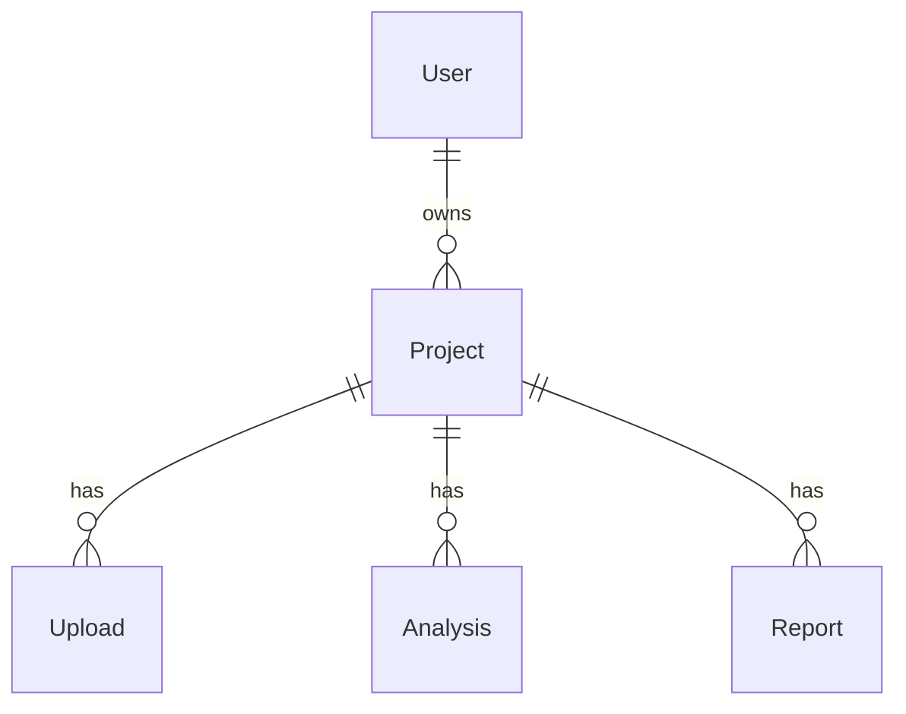
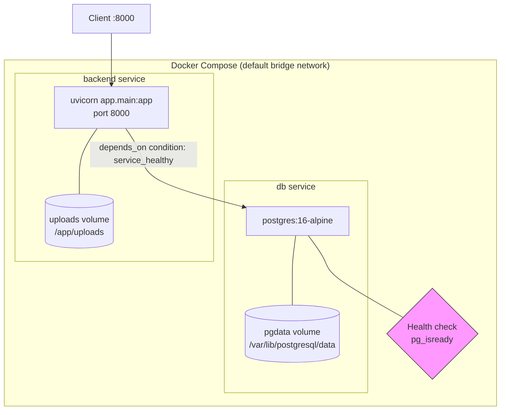

# ARCHITECTURE.md

# Legacy2Next — Architecture

> **Version:** 0.4.0
>
> **Status:** Implemented sections reflect the current repository. Planned sections describe upcoming milestones.
>
> **Cross-reference:** See `Legacy2Next_MASTER_PLAN.md` for product requirements, `Legacy2Next_AI_CONTEXT.md` for engineering rules, `Legacy2Next_PROJECT_STATE.md` for live implementation status.

---

# Implemented

---

## Project Overview

Legacy2Next is a FastAPI backend for legacy software analysis and modernization. At v0.4.0 the backend has a complete authentication system, a Projects CRUD module with ownership scoping, an Uploads module with file storage and quota management, a Discovery Engine, a Detector Framework with LanguageDetector, FrameworkDetector, and DependencyDetector, a PostgreSQL database with Alembic migrations, Docker Compose orchestration, and a storage abstraction layer. The auth, projects, uploads, and analysis (discovery + detector framework) modules are partially implemented; the remaining modules are stubs awaiting their milestone.

**Phase:** Development (Milestone 4 — Static Analysis in progress).

**What exists today:**

| Component | Status |
|---|---|
| FastAPI application factory (`app/main.py`) | Implemented |
| Core layer (config, database, security, exceptions, dependencies) | Implemented |
| Storage abstraction layer (`app/storage/`) | Implemented |
| Authentication module (register, login, JWT, /me) | Implemented |
| Projects module (5 CRUD endpoints, ownership-scoped) | Implemented |
| Uploads module (4 endpoints, file storage, quota, hash dedup) | Implemented |
| SQLAlchemy models (User, Project, Upload, Analysis, Report, Technology, AnalysisTechnology, AnalysisFile, Dependency, Metric) | Implemented |
| Alembic migration (10 tables, FKs, indexes) | Implemented |
| Discovery Engine (FileGraph, IgnoreRules, deterministic os.walk) | Implemented |
| Detector Framework (BaseDetector, LanguageDetector, FrameworkDetector, DependencyDetector, extension→language mapping) | Implemented |
| Docker Compose (PostgreSQL 16 Alpine + FastAPI) | Implemented |
| Dockerfile (python:3.12-slim, pip install) | Implemented |
| pyproject.toml (PEP 621, uv-compatible) | Implemented |
| Test scaffolding (pytest, TestClient, 8 test directories) | Scaffolded |
| 5 remaining modules (analysis, ai, documentation, modernization, reports) | Scaffolded — routes/services/schemas/repository stubs |
| Frontend (React + TypeScript + Vite) | Not initialized |
| Background workers, integrations | Placeholder directories |

---

## Backend Folder Structure

```
backend/
├── app/
│   ├── __init__.py
│   ├── main.py                          # FastAPI app factory, health endpoint, router includes
│   ├── core/
│   │   ├── __init__.py
│   │   ├── config.py                    # Settings via pydantic-settings (env file support)
│   │   ├── database.py                  # SQLAlchemy engine, sessionmaker, Base, get_db generator
│   │   ├── security.py                  # hash_password, verify_password, create/decode JWT
│   │   ├── exceptions.py                # AppException hierarchy (NotFound, Unauthorized, Conflict, FileValidation, QuotaExceeded, Storage)
│   │   └── dependencies.py              # get_current_user, get_storage_provider, get_quota_service
│   ├── storage/
│   │   ├── __init__.py
│   │   ├── base.py                      # StorageProvider ABC + FileStorageResult TypedDict
│   │   └── local.py                     # LocalStorageProvider (UUID filenames, per-project subdirs)
│   ├── models/
│   │   ├── __init__.py                  # Re-exports User, Project, Upload, Analysis, Report
│   │   ├── user.py                      # users table
│   │   ├── project.py                   # projects table (FK → users)
│   │   ├── upload.py                    # uploads table (FK → projects, SHA-256 hash, 5 indexes)
│   │   ├── analysis.py                  # analyses table (FK → projects)
│   │   └── report.py                    # reports table (FK → projects)
│   ├── modules/
│   │   ├── __init__.py
│   │   ├── auth/                        # Fully implemented (routes, service, schemas, repository)
│   │   ├── projects/                    # Fully implemented (routes, service, schemas, repository)
│   │   ├── uploads/                     # Fully implemented (routes, service, schemas, repository, quota)
│   │   ├── analysis/                    # Implemented: discovery, ignore_rules, base, types, utils, language_detector, framework_detector, dependency_detector, metrics_collector, pipeline (+ detectors/ subdirectory stubs)
│   │   ├── ai/                          # Scaffolded
│   │   ├── documentation/               # Scaffolded (+ generators/ subdirectory stubs)
│   │   ├── modernization/               # Scaffolded
│   │   └── reports/                     # Scaffolded
│   ├── workers/                         # Placeholder (empty __init__.py)
│   ├── integrations/                    # Placeholder (empty __init__.py)
│   └── utils/                           # Empty stubs (file_utils.py, validators.py)
├── alembic/
│   ├── alembic.ini                      # Points to app models, overrides sqlalchemy.url at runtime
│   ├── env.py                           # Autogenerate support, imports Base from app.models
│   ├── script.py.mako                   # Migration template
│   └── versions/
│       ├── b1a1677bc7ef_initial_migration.py  # Creates users, projects, analyses, reports
│       └── e6da2e749540_create_uploads_table.py  # Creates uploads table (FK to projects, SHA-256, 5 indexes)
├── tests/
│   ├── __init__.py
│   ├── conftest.py                      # TestClient fixture
│   ├── test_auth/                       # Empty __init__.py
│   ├── test_projects/                   # Empty __init__.py
│   ├── test_uploads/                    # Empty __init__.py
│   ├── test_analysis/
│   │   ├── __init__.py
│   │   ├── test_discovery.py            # 21 tests (DiscoveryEngine, IgnoreRules, FileGraph)
│   │   ├── test_detector_framework.py   # 48 tests (BaseDetector, types, utils, LanguageDetector)
│   │   ├── test_framework_detector.py   # 45 tests (FrameworkDetector, EvidenceRule hierarchy)
│   │   ├── test_dependency_detector.py   # 93 tests (DependencyDetector, 9 parsers, dedup)
│   │   ├── test_metrics_collector.py     # 51 tests (MetricsCollector)
│   │   └── test_pipeline.py              # 27 tests (AnalysisPipeline)
│   ├── test_ai/                         # Empty __init__.py
│   ├── test_documentation/              # Empty __init__.py
│   ├── test_modernization/              # Empty __init__.py
│   └── test_reports/                    # Empty __init__.py
├── uploads/                             # Created at runtime; mounted as Docker named volume
├── pyproject.toml                       # PEP 621, ruff, mypy config
├── Dockerfile                           # python:3.12-slim, pip install ., uvicorn
└── .env.example                         # All config keys with default values
```

### AnalysisPipeline — Orchestration Layer

`AnalysisPipeline` coordinates the entire analysis workflow. It is a pure orchestrator — no detection logic, no aggregation logic, no persistence.

```
AnalysisPipeline
├── analyze(root_path, upload_id, project_id) → AnalysisResults
│   ├── 1. DiscoveryEngine.discover()          → DiscoveryContext
│   ├── 2. LanguageDetector.detect(context)    → DetectorResult
│   ├── 3. FrameworkDetector.detect(context)   → DetectorResult
│   ├── 4. DependencyDetector.detect(context)  → DetectorResult
│   ├── 5. MetricsCollector.collect(results)   → DetectorResult (metrics)
│   └── 6. Return final AnalysisResults
├── Constructor injection: engine, detectors, metrics_collector
├── Sequential execution — no threading, no async
├── Failure isolation — detector exceptions caught and wrapped
├── DiscoveryException propagates (no analysis without discovery)
└── Deterministic — same project → same results, same order
```

### MetricsCollector — Aggregation Stage

`MetricsCollector` is a pure aggregation component that computes project-level metrics from detector outputs. It is NOT a `BaseDetector` subclass — it reads `AnalysisResults`, not `DiscoveryContext`.

```
MetricsCollector
├── collect(results: AnalysisResults) → DetectorResult
│   ├── project.total_files
│   ├── project.total_file_size
│   ├── languages.count
│   ├── languages.primary
│   ├── frameworks.count
│   ├── dependencies.count
│   ├── dependencies.<ecosystem>  (dynamic, per ecosystem)
│   └── manifests.count
├── Zero I/O — no filesystem, no database, no network
├── O(n) in detector output size
├── Deterministic — same input → same output, stable ordering
└── Never mutates AnalysisResults
```

Fixed metric keys are defined in `metric_keys.py` as a `MetricKey(StrEnum)`:
```python
class MetricKey(StrEnum):
    PROJECT_TOTAL_FILES = "project.total_files"
    PROJECT_TOTAL_FILE_SIZE = "project.total_file_size"
    LANGUAGE_COUNT = "languages.count"
    PRIMARY_LANGUAGE = "languages.primary"
    FRAMEWORK_COUNT = "frameworks.count"
    DEPENDENCY_COUNT = "dependencies.count"
    MANIFEST_COUNT = "manifests.count"
```

Dynamic ecosystem keys follow the pattern `f"dependencies.{ecosystem}"`.

`DetectedMetric.value` supports `int | str` (widened from `int` in M4.6B) to accommodate string-valued metrics like `languages.primary = "Python"`.

### Module-internal convention

Every module under `modules/` follows a consistent file layout:

```
module_name/
├── __init__.py
├── routes.py          # APIRouter, endpoint definitions, dependency injection
├── service.py         # Business logic, calls repository
├── schemas.py         # Pydantic request/response models
└── repository.py      # SQLAlchemy queries (data access)
```

The `analysis` module contains an extra `detectors/` subdirectory for future pluggable analysis strategies. The detection framework (BaseDetector, LanguageDetector, FrameworkDetector, DependencyDetector) is now implemented; the existing `detectors/language.py`, `detectors/framework.py`, `detectors/dependency.py` stubs remain unused until migration.

---

## Layer Architecture

Every request follows a four-layer path through the backend:

```
┌─────────────┐      ┌───────────┐      ┌────────────┐      ┌──────────┐
│   Routes    │ ───▶ │ Services  │ ───▶ │ Repository │ ───▶ │ Database │
│ (endpoints) │ ◀─── │ (business │ ◀─── │ (data      │ ◀─── │ (Postgre │
│             │      │  logic)   │      │  access)   │      │  SQL)    │
└─────────────┘      └───────────┘      └────────────┘      └──────────┘
        │                                                          
        │ (HTTP response)                                         
        ▼                                                         
     Client
```

**Implemented layers:**

- **Routes** (`modules/*/routes.py`): Define `APIRouter` instances and endpoint functions. Use `Depends()` for dependency injection (database session, authenticated user). Return Pydantic response models. Do not contain database or business logic.

- **Services** (`modules/*/service.py`): Pure business logic — validation, orchestration, security checks. Call repository functions for data access. Raise `AppException` subclasses for error cases. No direct DB access.

- **Repository** (`modules/*/repository.py`): Data-access functions. Each function receives a `Session` and returns domain objects (`User`, `Project`, etc.). No business logic, no HTTP concerns.

- **Database** (`app/core/database.py`): Engine configuration (connection pooling, echo), `SessionLocal` factory, `get_db` generator for dependency injection, `declarative_base` for model definitions.

**The auth, projects, and uploads modules have all four layers implemented.** The uploads module additionally implements a `quota.py` service for storage quota enforcement. All other modules have empty or minimal stubs at every layer (e.g., `routes.py` contains only `router = APIRouter(...)`, `service.py` contains only imports).

---

## Request Lifecycle

```
1. HTTP request arrives at Uvicorn
       │
2. FastAPI matches route (e.g., POST /auth/register)
       │
3. FastAPI validates request body against Pydantic schema (RegisterRequest)
       │
4. Dependency injection resolves parameters:
   ├── Depends(get_db) → yields SQLAlchemy Session
   └── Depends(get_current_user) → decodes JWT, fetches User (for protected routes)
       │
5. Route handler calls service function
       │
6. Service calls repository function
       │
7. Repository executes SQLAlchemy query
       │
8. Response is serialized through Pydantic response_model
       │
9. FastAPI returns JSON response
```

Step 4 applies differently per endpoint:
- `POST /auth/register` — injects `db` only
- `POST /auth/login` — injects `db` only
- `GET /auth/me` — injects `db` + `current_user` (JWT required)
- `POST /projects` — injects `body` + `current_user` + `db`
- `GET /projects` — injects `current_user` + `db`
- `GET /projects/{project_id}` — injects `project_id` + `current_user` + `db`
- `PATCH /projects/{project_id}` — injects `project_id` + `body` + `current_user` + `db`
- `DELETE /projects/{project_id}` — injects `project_id` + `current_user` + `db`
- `POST /projects/{project_id}/uploads` — injects `files` (multipart) + `project_id` + `current_user` + `db` + `provider` + `quota_service`
- `GET /projects/{project_id}/uploads` — injects `project_id` + `current_user` + `db`
- `GET /uploads/{upload_id}` — injects `upload_id` + `current_user` + `db`
- `DELETE /uploads/{upload_id}` — injects `upload_id` + `current_user` + `db` + `provider`

---

## Dependency Injection

The DI container is managed entirely by FastAPI's `Depends()` mechanism.

| Dependency | Location | Used By |
|---|---|---|
| `get_db` — yields SQLAlchemy `Session` | `app/core/database.py:17` | All route handlers that need DB access |
| `get_current_user` — returns `User` from JWT token | `app/core/dependencies.py:14` | All protected endpoints: `GET /auth/me`, `/projects/*`, `/uploads/*` |
| `get_storage_provider` — returns `LocalStorageProvider` | `app/core/dependencies.py:18` | Upload endpoints: `POST /projects/{id}/uploads`, `DELETE /uploads/{id}` |
| `get_quota_service` — returns `QuotaService` | `app/core/dependencies.py:22` | Upload endpoint: `POST /projects/{id}/uploads` |

**`get_db` lifecycle:** A session is created at the start of each request and closed in the `finally` block of the generator. FastAPI handles the dependency lifecycle per request — no manual session management is required in route handlers.

**`get_current_user` chain:**
1. `OAuth2PasswordBearer(tokenUrl="/auth/login")` extracts the `Authorization: Bearer <token>` header
2. `auth_service.get_current_user(db, token)` decodes the JWT via `decode_access_token`, extracts `sub` (user ID), fetches the user via `repository.get_by_id`
3. Returns `User` or raises `401 UnauthorizedException`

---

## Authentication Flow

```
┌──────┐          ┌──────────┐          ┌───────────┐          ┌──────────┐
│Client│          │  Routes  │          │  Service  │          │Repository│
└──┬───┘          └────┬─────┘          └─────┬─────┘          └────┬─────┘
   │                   │                      │                     │
   │  POST /auth/register                     │                     │
   │  {email,password,name}                   │                     │
   ├──────────────────▶│                      │                     │
   │                   │  service.register()  │                     │
   │                   ├─────────────────────▶│                     │
   │                   │                      │  get_by_email()     │
   │                   │                      ├────────────────────▶│
   │                   │                      │  User │ None        │
   │                   │                      │◀────────────────────┤
   │                   │                      │                     │
   │                   │                      │  (if exists)        │
   │                   │                      │  409 ConflictException
   │                   │                      │                     │
   │                   │                      │  hash_password()    │
   │                   │                      │  create()           │
   │                   │                      ├────────────────────▶│
   │                   │                      │  User               │
   │                   │                      │◀────────────────────┤
   │                   │  201 UserResponse    │                     │
   │◀──────────────────┤                      │                     │
   │                   │                      │                     │
   │  POST /auth/login │                      │                     │
   │  {email,password} │                      │                     │
   ├──────────────────▶│                      │                     │
   │                   │  service.login()     │                     │
   │                   ├─────────────────────▶│                     │
   │                   │                      │  get_by_email()     │
   │                   │                      ├────────────────────▶│
   │                   │                      │  User               │
   │                   │                      │◀────────────────────┤
   │                   │                      │                     │
   │                   │                      │  (if no user OR     │
   │                   │                      │   bad password)     │
   │                   │                      │  401 Unauthorized   │
   │                   │                      │                     │
   │                   │                      │  verify_password()  │
   │                   │                      │  create_access_token│
   │                   │  TokenResponse       │                     │
   │◀──────────────────┤                      │                     │
   │                   │                      │                     │
   │  GET /auth/me     │                      │                     │
   │  Authorization:   │                      │                     │
   │  Bearer <token>   │                      │                     │
   ├──────────────────▶│                      │                     │
   │                   │  Depends(get_current_user)                  │
   │                   │                      │                     │
   │                   │                      │  decode_access_token│
   │                   │                      │  get_by_id()        │
   │                   │                      ├────────────────────▶│
   │                   │                      │  User               │
   │                   │                      │◀────────────────────┤
   │                   │  200 UserResponse    │                     │
   │◀──────────────────┤                      │                     │
```

### Token details

- Algorithm: HS256
- Claims: `sub` (user ID, int → str), `iat` (issued at, UTC), `exp` (expiration, UTC)
- Expiry: 30 minutes (`ACCESS_TOKEN_EXPIRE_MINUTES` in `Settings`)
- No refresh tokens, no token blacklist — client-side discard on logout
- `OAuth2PasswordBearer` configured with `tokenUrl="/auth/login"` (metadata only for OpenAPI; the login endpoint accepts JSON, not form data)

### Password hashing

- Library: `passlib` with `bcrypt` backend
- bcrypt pinned to `>=4.0.0,<4.1.0` for passlib compatibility (bcrypt 4.1.0+ broke passlib's internal `_bcrypt.hashpw` call)
- Two functions in `app/core/security.py`: `hash_password` and `verify_password`

---

## Database Architecture

### Connection management (`app/core/database.py`)

```
SQLAlchemy Engine
├── DATABASE_URL (configurable via Settings / DATABASE_URL env var)
├── pool_size=5
├── max_overflow=10
├── pool_pre_ping=True
└── echo=DATABASE_ECHO (configurable, defaults to False)
       │
       ▼
SessionLocal (sessionmaker)
       │
       ▼
get_db() → yields Session per request
```

- `pool_pre_ping=True` verifies connections before use (handles dropped connections gracefully)
- `echo` is gated behind `DATABASE_ECHO` (not `DEBUG`) so SQL logging is independently controllable
- No async engine — synchronous SQLAlchemy throughout

### Entity relationships



- **User** — authenticated account (email, password_hash, name, timestamps)
- **Project** — uploaded legacy project owned by a User (name, description, language, framework, file_count, status, timestamps)
- **Upload** — file uploaded to a Project (original_name, stored_name, file_path, file_size, mime_type, extension, sha256_hash, status, timestamps)
- **Analysis** — static analysis run on a Project (status, created_at)
- **Report** — generated report for a Project (created_at)

All entities share a common pattern: integer primary key, server-default `created_at` timestamp, and a foreign key ownership chain: User → Projects → Uploads/Analyses/Reports.

### Migration strategy

- Alembic autogenerate (`alembic revision --autogenerate`)
- Migration not applied automatically on startup — explicit developer action (`alembic upgrade head`)
- `env.py` overrides `sqlalchemy.url` from `Settings.DATABASE_URL` at runtime
- `app.models.*` imported in `env.py` so autogenerate detects model changes

---

## Docker Compose Architecture



### Service configuration

| Property | db | backend |
|---|---|---|
| Image | `postgres:16-alpine` | Build from `./backend` |
| Environment | `POSTGRES_USER=postgres`<br/>`POSTGRES_PASSWORD=postgres`<br/>`POSTGRES_DB=legacy2next` | `DATABASE_URL=postgresql://postgres:postgres@db:5432/legacy2next` |
| Ports | Not exposed | `8000:8000` |
| Volumes | `pgdata:/var/lib/postgresql/data` | `uploads:/app/uploads` |
| Health check | `pg_isready -U postgres` (5s interval, 5 retries) | None |
| Restart | `unless-stopped` | `unless-stopped` |
| Depends on | — | `db` (condition: `service_healthy`) |

### Network details

- Default Compose bridge network (service-to-service resolution by name)
- PostgreSQL port not exposed to host — avoids port conflicts with local PostgreSQL instances
- `DATABASE_URL` overridden in `environment` (not `env_file`) for the backend service
- Local development uses `localhost` (from `.env` or `Settings` defaults); Docker environment switches to `db` hostname

---

## Error Handling Architecture

```
AppException (HTTPException)
├── status_code: int
└── detail: {"code": str, "message": str}

Concrete subclasses:
├── NotFoundException          → 404, code="{ENTITY}_NOT_FOUND"
├── UnauthorizedException      → 401, code="UNAUTHORIZED"
├── ConflictException          → 409, code=explicit
├── ValidationException        → 400, code="VALIDATION_ERROR"
├── FileValidationException    → 400, code=explicit
├── QuotaExceededException     → 400, code="PROJECT_STORAGE_LIMIT"
└── StorageException           → 500, code="STORAGE_ERROR"
```

- All exceptions inherit from `fastapi.HTTPException` so FastAPI handles them natively — no custom middleware or exception handlers are registered
- `detail` is structured as `{"code": "...", "message": "..."}` for consistent client-side parsing
- Used in `auth/service.py`:
  - `ConflictException("EMAIL_EXISTS", ...)` on duplicate registration (409)
  - `UnauthorizedException("Invalid email or password")` on bad credentials (401)
  - `UnauthorizedException("Invalid or expired token")` on bad/missing JWT (401)
- Used in `projects/service.py`:
  - `NotFoundException("Project")` when project not found or not owned (404)
  - `ValidationException("At least one field must be provided")` on empty PATCH body (400)
- Used in `uploads/service.py`:
  - `NotFoundException("Project")` when project not found or not owned (404)
  - `NotFoundException("Upload")` when upload not found (404)
  - `FileValidationException("EMPTY_FILE", ...)` on no files or empty files (400)
  - `FileValidationException("INVALID_FILENAME", ...)` on path separators, `..`, or null bytes (400)
  - `FileValidationException("INVALID_FILE_TYPE", ...)` on disallowed extension (400)
  - `StorageException(...)` when DB deletion fails after file removal (500)
- Used in `uploads/quota.py`:
  - `QuotaExceededException(...)` when project storage limit exceeded (400)

---

## Module Organisation

### Auth module (fully implemented)

| File | Responsibility |
|---|---|
| `routes.py` | 3 endpoints: POST `/register` (201), POST `/login` (200), GET `/me` (200) |
| `schemas.py` | `RegisterRequest` (EmailStr, password ≥8 chars, name 1-100), `LoginRequest`, `TokenResponse` (access_token + token_type), `UserResponse` (id, email, name) |
| `service.py` | `register`: duplicate check → hash → create; `login`: lookup → verify → token; `get_current_user`: decode → lookup |
| `repository.py` | `get_by_email`, `get_by_id`, `create` — SQLAlchemy queries only |

---

### Projects module (fully implemented)

| File | Responsibility |
|---|---|
| `routes.py` | 5 endpoints: POST `/projects` (201), GET `/projects` (200), GET `/projects/{id}` (200), PATCH `/projects/{id}` (200), DELETE `/projects/{id}` (204) |
| `schemas.py` | `ProjectCreate` (name 1-100, description optional max 1000), `ProjectUpdate` (name/description both optional), `ProjectResponse` (id, name, description, language, framework, file_count, status, timestamps), `ProjectListResponse` (wraps list) |
| `service.py` | `create_project`: creates project with ownership; `get_project`: ownership check → return; `list_projects`: list by owner; `update_project`: ownership check → validate non-empty → apply updates; `delete_project`: ownership check → delete. Uses private `_get_owned_project` helper for ownership enforcement. |
| `repository.py` | `get_project_by_id`, `list_projects_by_owner`, `create_project`, `update_project`, `delete_project` — all use ORM-object interfaces, no dicts |

---

### Uploads module (fully implemented)

| File | Responsibility |
|---|---|
| `routes.py` | 4 endpoints: POST `/projects/{id}/uploads` (201), GET `/projects/{id}/uploads` (200), GET `/uploads/{id}` (200), DELETE `/uploads/{id}` (204) |
| `schemas.py` | `UploadResponse` (id, project_id, original_name, file_size, mime_type, extension, status, created_at), `UploadListResponse` (wraps list) |
| `service.py` | `upload_files`: validate filenames/extensions → check dimensions → hash content → save to storage → create DB records with batch rollback; `list_uploads`: project ownership check → list; `get_upload`: ownership check → return; `delete_upload`: ownership check → delete file first → delete DB record. Uses `_get_owned_project` and `_get_owned_upload` helpers for ownership enforcement. |
| `repository.py` | `create_upload`, `get_upload_by_id`, `list_uploads_by_project`, `delete_upload`, `get_project_total_storage` — all ORM-object interfaces |
| `quota.py` | `QuotaService.check_storage_quota`: reads `MAX_PROJECT_STORAGE_GB` from settings, compares current project usage + incoming bytes against limit |

**Storage layer** (`app/storage/`): `StorageProvider` ABC with `save`, `delete`, `full_path`, `exists` methods. `LocalStorageProvider` implements disk storage with UUID hex filenames under `<UPLOAD_ROOT>/<project_id>/files/`.

---

# Planned

---

## Frontend

A React + TypeScript + Vite + TailwindCSS application will be initialized in the `frontend/` directory. The frontend directory currently exists but is empty.

## Planned Modules

| Module | Status |
|---|---|
| **Analysis** | In progress. Discovery Engine (FileGraph, IgnoreRules, DiscoveryEngine), Detector Framework (BaseDetector, LanguageDetector, FrameworkDetector, DependencyDetector, extension→language mapping), MetricsCollector, and AnalysisPipeline implemented. Routes, service, schemas, repository stubs exist. Remaining: AnalysisWriter. |
| **AI** | Planned (not yet implemented). Module scaffolded — routes, service, schemas, repository stubs exist. |
| **Documentation** | Planned (not yet implemented). Module scaffolded — routes, service, schemas, repository stubs exist; `generators/` subdirectory present but empty. |
| **Modernization** | Planned (not yet implemented). Module scaffolded — routes, service, schemas, repository stubs exist. |
| **Reports** | Planned (not yet implemented). Module scaffolded — routes, service, schemas, repository stubs exist. |

Uploads (M3) is now complete. Remaining modules will be implemented in milestone order: Analysis in M4, AI in M5, Documentation/Modernization/Reports in M6.

## Database Schema Expansion

- Fields were intentionally stripped from models during Milestone 1 to keep the foundation focused. They will be added back during their respective milestones.
- Future schemas will include JSON fields, text content storage, and additional join tables.

## Background Workers (`app/workers/`)

- Placeholder for Celery or similar background task processing
- Use case: running static analysis and AI inference asynchronously

## External Integrations (`app/integrations/`)

- Placeholder for adapters to AI providers (OpenAI API, etc.)
- Pluggable design so analysis and documentation generation can swap backends

---

## Architecture Evolution

### Current Milestone — Milestone 4

```
                                                                   ┌──────────────┐
                                                                   │   Frontend   │
                                                                   │  (not yet)   │
                                                                   └──────────────┘
                                                                          │
                                                                          ▼
┌──────────┐     ┌──────────────────────────────────────────────────────────┐
│  Client   │────▶                    FastAPI Backend                       │
│ (curl/   │     ├──────────┬──────────┬──────────┬──────────┬─────────────┤
│  Swagger)│     │  Core    │   Auth   │ Project  │ Uploads  │  Analysis      │
└──────────┘     │  Layer   │   ✅     │   ✅     │   ✅                       │  (disc+det+fwk+dep)│
                 ├──────────┤          │          │          ├─────────────┤
                 │ Config   │          │          │          │   AI        │
                 │ Database │          │          │          │  (stub)     │
                 │ Security │          │          │          ├─────────────┤
                 │ Exceptions│         │          │          │ Documentation│
                 │ Deps     │          │          │          │  (stub)     │
                 ├──────────┤          │          │          ├─────────────┤
                 │ Models   │          │          │          │ Modernization│
                 │ (User,   │          │          │          │  (stub)     │
                 │ Project, │          │          │          ├─────────────┤
                 │ Upload,  │          │          │          │  Reports    │
                 │ Analysis,│          │          │          │  (stub)     │
                 │ Report)  │          │          │          │             │
                 └──────────┴──────────┴──────────┴──────────┴─────────────┘
                      │
                      ▼
              ┌──────────────┐
              │  PostgreSQL  │
              │  (Docker)    │
              └──────────────┘
```

✅ = implemented; (disc+det+fwk+dep+metrics+pipeline) = discovery + detector framework + FrameworkDetector + DependencyDetector + MetricsCollector + AnalysisPipeline implemented; everything else is scaffolded.

### Next Milestones

- **M4.8 (AnalysisWriter):** AnalysisService integration, database persistence
- **M5 (AI Integration):** Implement `ai` module — AI-powered project summary, file explanation, documentation generation, recommendations
- **M6 (Dashboard):** Implement `reports` and `documentation` modules — dashboard endpoints, report generation, documentation viewer, modernization suggestions
- **M7 (Finalization):** Testing, bug fixes, deployment configuration, remaining documentation
